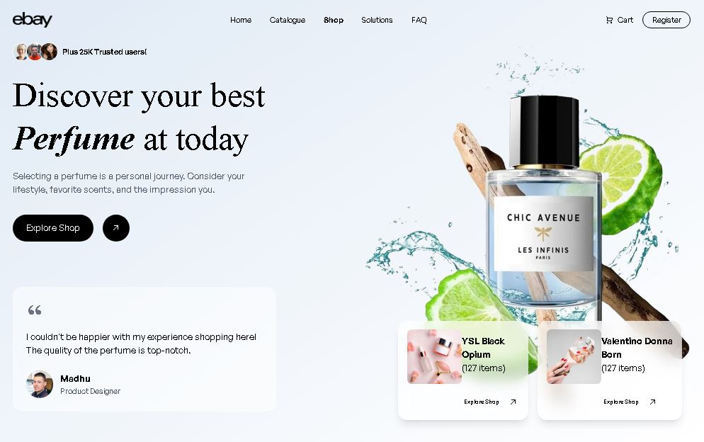

# Ebay Perfume - A Cinematic Landing Page Experience

Welcome to the official repository for the **Ebay Perfume** landing page, a modern, single-page web experience designed to be both visually stunning and highly interactive.

This project was brought to life using the **Gemini CLI tool**, a cutting-edge assistant for software development. The entire layout, from the hero section to the footer, was bootstrapped by providing a single design image to the AI, which then generated the foundational code.

<br>



---

## ✨ The Genesis: From Image to Reality

This project serves as a powerful demonstration of AI-assisted development. The core structure and style were generated by the Gemini CLI based on a visual prompt—a `.JPG` image of the desired layout. 

The process was as follows:
1.  **Provide the Image:** We gave the Gemini CLI a target design.
2.  **AI Scaffolding:** The tool analyzed the image and generated the complete HTML structure, Tailwind CSS classes, and even placeholder animations with GSAP.
3.  **Iterative Refinement:** From the solid foundation provided by the AI, we then customized and extended the site, adding more complex animations and sections to build the final, polished product.

This project is a testament to how developers can leverage AI to accelerate the initial, often time-consuming, phases of web development and focus more on creative and technical refinement.

---

## 🚀 Key Features

- **Cinematic Animations:** Smooth, high-fidelity animations powered by **GSAP (GreenSock Animation Platform)**, including a seamless horizontal scrolling product showcase.
- **Fluid User Experience:** Integrated with the **Lenis** library for an exceptionally smooth scrolling effect.
- **Fully Responsive:** A clean, modern layout built with **Tailwind CSS** that looks great on all devices.
- **Complete Structure:** Includes all the essential sections for a high-end landing page:
  - Dynamic Hero Section
  - Brand Partners
  - Horizontal Product Showcase
  - Customer Reviews
  - Email Subscription CTA
  - Comprehensive Footer
- **AI-Generated Foundation:** A unique starting point that can be easily adapted and customized for your own projects.

---

## 🛠️ Tech Stack

- **HTML5**
- **CSS3** with **Tailwind CSS**
- **JavaScript**
- **GSAP (GreenSock Animation Platform)** for animations
- **ScrollTrigger** for scroll-based animations
- **Lenis** for smooth scrolling

---

## 📁 Project Structure

```
.
├── public/
│   ├── css/
│   │   └── style.css         # Custom CSS & font imports
│   ├── images/
│   │   └── Capture.JPG       # The original design prompt image
│   ├── js/
│   │   └── script.js         # GSAP animations & Lenis setup
│   └── index.html            # Main HTML file
└── README.md                 # You are here!
```

---

## 🏁 Getting Started

To view the website, simply open the `public/index.html` file in your preferred web browser.

```bash
# Example for macOS
open public/index.html

# Example for Windows
start public/index.html
```

---

## 🎨 Making It Your Own

This project was designed to be a strong foundation. The code generated by the Gemini CLI is clean and well-structured, making it easy for you to:

- **Change the Content:** Easily swap out the text and images in the `index.html` file.
- **Tweak the Style:** Modify the Tailwind CSS classes or add your own styles in `css/style.css`.
- **Adjust Animations:** Fine-tune the GSAP animation timelines in `js/script.js` to match your brand's feel.

Feel free to clone this repository and use it as a starting point for your own cinematic web experiences!
